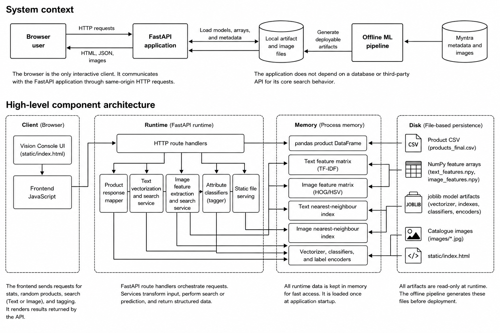
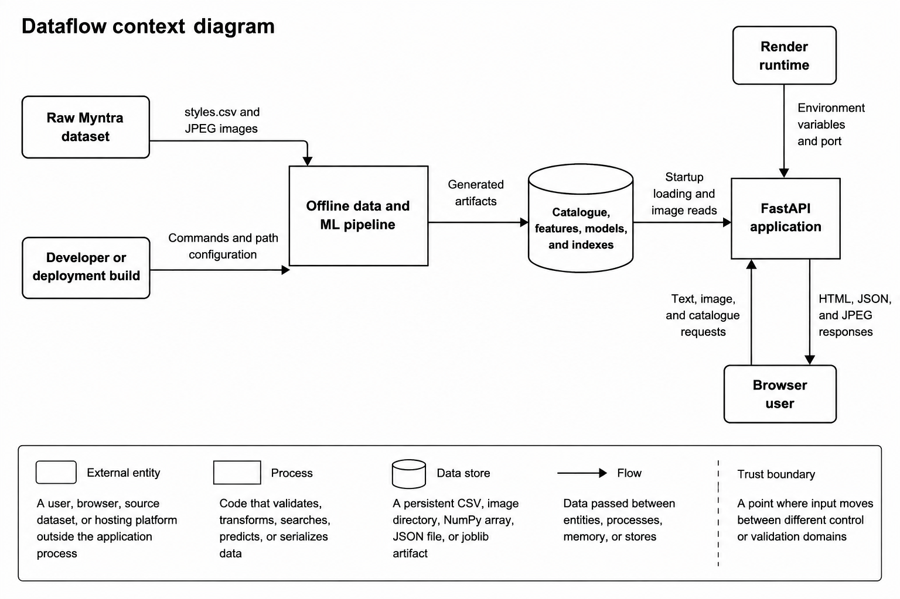

# Visual Fashion Search

Search a fashion catalogue with natural language or an uploaded image. Vision
Console combines computer vision, text retrieval, attribute classification,
FastAPI, and a responsive browser interface in one end-to-end ML project.

[](https://visual-fashion-search.onrender.com)
[](https://fastapi.tiangolo.com/)
[](https://www.python.org/)

**Live demo:** [visual-fashion-search.onrender.com](https://visual-fashion-search.onrender.com)

> The hosted demo uses a deterministic, category-balanced catalogue of 1,331
> products. Render's free service may take a short time to wake after inactivity.

## Features

- Search 44,064 local catalogue products using natural-language descriptions.
- Upload a fashion image and retrieve visually similar products.
- Predict master category, subcategory, base colour, season, and usage.
- Display confidence values for every predicted attribute.
- Use built-in sample images to test image search immediately.
- Explore the generated FastAPI interface at `/docs`.
- Run a full local catalogue or a smaller deployment profile with the same code.

Try queries such as `red shoes`, `black sports t-shirt`, or
`women casual handbag`.

## Architecture



The web process loads the catalogue, indexes, vectorizer, classifiers, and
label encoders once at startup. Runtime requests are read-only; model and
catalogue preparation happens in the offline pipeline.

Read the detailed [Architecture Report](docs/ARCHITECTURE_REPORT.md).

## Data and model flow



Read the detailed [Dataflow Report](docs/DATAFLOW_REPORT.md).

## Technology stack

| Layer | Technology |
|---|---|
| API | FastAPI, Uvicorn, Pydantic |
| Frontend | HTML, CSS, and vanilla JavaScript |
| Data processing | pandas and NumPy |
| Image processing | Pillow and scikit-image |
| Image representation | HSV colour histogram and HOG |
| Text representation | TF-IDF with up to 1,000 terms |
| Attribute prediction | Five logistic-regression classifiers |
| Similarity retrieval | Brute-force cosine nearest neighbours |
| Persistence | CSV, NumPy, JSON, JPEG, and joblib |
| Hosting | Render |

## How search works

### Text search

Product display name, article type, base colour, and usage are combined into a
text corpus. A fitted TF-IDF vectorizer transforms catalogue records and new
queries into the same 1,000-dimensional space. Cosine nearest-neighbour search
returns the ranked products.

### Image search

Every image is resized to 64 by 64 pixels and represented by:

- 24 HSV colour-histogram values; and
- HOG features describing shape and texture.

The combined 1,592-dimensional vector is L2-normalized and compared with the
catalogue using cosine distance.

### Auto-tagging

Five logistic-regression models predict `masterCategory`, `subCategory`,
`baseColour`, `season`, and `usage`. Base-colour prediction uses the first 24
colour features; the other models use the complete image vector.

## Quick start

### Requirements

- Python 3.11 or newer
- PowerShell, Command Prompt, or a Unix-compatible shell
- The Myntra fashion product dataset for full local setup

### 1. Create the environment

From the project directory in PowerShell:

```powershell
python -m venv venv
Set-ExecutionPolicy -Scope Process -ExecutionPolicy Bypass
.\venv\Scripts\Activate.ps1
python -m pip install -r requirements.txt
```

On macOS or Linux:

```bash
python3 -m venv venv
source venv/bin/activate
python -m pip install -r requirements.txt
```

### 2. Choose a data profile

#### Option A: Existing full artifacts

If `archive/`, `data/`, and `models/` are populated, start directly:

```powershell
python -m uvicorn app.main:app --host 127.0.0.1 --port 8000
```

#### Option B: Build full artifacts from raw data

Place the dataset at:

```text
archive/
├── styles.csv
└── images/
    ├── 1163.jpg
    └── ...
```

Run the pipeline once, in order:

```powershell
python prepare_data.py
python extract_features.py
python train_classifiers.py
python build_index.py
python -m uvicorn app.main:app --host 127.0.0.1 --port 8000
```

#### Option C: Run the reduced deployment profile

Use the committed `deploy/` catalogue and artifacts:

```powershell
$env:DATASET_DIR = "$PWD\deploy\archive"
$env:APP_DATA_DIR = "$PWD\deploy\data"
$env:APP_MODELS_DIR = "$PWD\deploy\models"

python -m uvicorn app.main:app --host 127.0.0.1 --port 8000
```

### 3. Open the application

- App: [http://localhost:8000](http://localhost:8000)
- API documentation: [http://localhost:8000/docs](http://localhost:8000/docs)
- Catalogue statistics: [http://localhost:8000/api/stats](http://localhost:8000/api/stats)

Stop Uvicorn with `Ctrl+C`.

Clear deployment-profile variables with:

```powershell
Remove-Item Env:DATASET_DIR -ErrorAction SilentlyContinue
Remove-Item Env:APP_DATA_DIR -ErrorAction SilentlyContinue
Remove-Item Env:APP_MODELS_DIR -ErrorAction SilentlyContinue
```

## Build the reduced demo dataset

Generate a deterministic deployment archive from the full catalogue:

```powershell
python build_demo_dataset.py
```

The default retains up to 300 products per master category. To use another
limit:

```powershell
python build_demo_dataset.py --per-category 150
```

Then build its processed artifacts:

```powershell
$env:DATASET_DIR = "$PWD\deploy\archive"
$env:APP_DATA_DIR = "$PWD\deploy\data"
$env:APP_MODELS_DIR = "$PWD\deploy\models"

python prepare_data.py
python extract_features.py
python train_classifiers.py
python build_index.py
```

Sampling uses random seed 42, making the subset reproducible for a given source
catalogue.

## API reference

| Method | Endpoint | Description |
|---|---|---|
| `GET` | `/` | Serve the frontend |
| `GET` | `/api/random?n=12` | Return random catalogue products |
| `GET` | `/api/samples?n=12` | Return deterministic category-diverse samples |
| `GET` | `/api/product/{id}` | Return one product or HTTP 404 |
| `POST` | `/api/search/text` | Search with a JSON text query |
| `POST` | `/api/search/image` | Upload an image for tagging and visual search |
| `GET` | `/api/stats` | Return catalogue size and category counts |
| `GET` | `/images/{filename}` | Serve a catalogue image |
| `GET` | `/docs` | Open interactive API documentation |

### Text-search example

```powershell
$body = @{ query = "red shoes"; k = 5 } | ConvertTo-Json
Invoke-RestMethod `
  -Uri http://localhost:8000/api/search/text `
  -Method Post `
  -ContentType "application/json" `
  -Body $body
```

Request body:

```json
{
  "query": "red shoes",
  "k": 5
}
```

### Image-search example

```powershell
curl.exe -X POST `
  -F "file=@archive/images/10008.jpg" `
  -F "k=5" `
  http://localhost:8000/api/search/image
```

The response contains `predicted_tags` and `similar_products`.

## Model evaluation snapshot

The training pipeline uses an 85/15 split with random seed 42 and writes its
metrics to `models/classifier_meta.json`.

| Target | Classes | Accuracy | Macro F1 |
|---|---:|---:|---:|
| Master category | 7 | 0.9363 | 0.6885 |
| Subcategory | 45 | 0.8455 | 0.5813 |
| Base colour | 46 | 0.2481 | 0.0157 |
| Season | 4 | 0.6256 | 0.6335 |
| Usage | 8 | 0.6832 | 0.3708 |

These are stored holdout results, not cross-validation metrics. Base-colour
performance shows that the current classical feature baseline has substantial
room for improvement.

## Verification

The full local profile passed 16 functional and integration checks covering:

- Python compilation and dependency imports;
- alignment of 44,064 catalogue rows with both feature matrices;
- artifact loading and FastAPI startup;
- frontend and OpenAPI delivery;
- catalogue, text-search, and image-search APIs;
- image auto-tagging; and
- correct HTTP 404 and HTTP 422 handling.

The live Render API was also checked and reported 1,331 hosted products.

Read the [Test and Evaluation Report](docs/TEST_AND_EVALUATION_REPORT.md).

## Project structure

```text
visual-fashion-search/
├── app/
│   └── main.py                    FastAPI application and routes
├── archive/                       Full raw metadata and images
├── data/                          Full processed metadata and features
├── models/                        Full models, indexes, and metrics
├── deploy/
│   ├── archive/                   Reduced raw demo catalogue
│   ├── data/                      Reduced processed features
│   └── models/                    Reduced models and indexes
├── docs/
│   ├── ARCHITECTURE_REPORT.md
│   ├── DATAFLOW_REPORT.md
│   └── TEST_AND_EVALUATION_REPORT.md
├── static/
│   └── index.html                 Browser interface
├── build_demo_dataset.py          Build a category-balanced demo archive
├── build_index.py                 Build image and text search indexes
├── config.py                      Resolve environment-aware paths
├── extract_features.py            Extract HSV, HOG, and TF-IDF features
├── prepare_data.py                Validate and clean catalogue metadata
├── train_classifiers.py           Train the five attribute classifiers
├── render.yaml                    Render deployment definition
└── requirements.txt               Python dependencies
```

## Documentation

| Document | Contents |
|---|---|
| [Architecture Report](docs/ARCHITECTURE_REPORT.md) | Components, runtime model, deployment, decisions, risks, and evolution path |
| [Dataflow Report](docs/DATAFLOW_REPORT.md) | Offline and online flows, stores, schemas, trust boundaries, and lifecycle |
| [Test and Evaluation Report](docs/TEST_AND_EVALUATION_REPORT.md) | Environment, methodology, 16 test cases, evidence, limitations, and assessment |

## Deployment

`render.yaml` defines one Render Python web service. The build installs
dependencies, selects the reduced `deploy/` profile, and regenerates features,
classifiers, and indexes. The start command launches Uvicorn on the
platform-provided port.

**Live:** [https://visual-fashion-search.onrender.com](https://visual-fashion-search.onrender.com)

## Current limitations

- Image features are a CPU-friendly HSV/HOG baseline rather than deep semantic
  embeddings such as CLIP.
- Exact brute-force search grows linearly with catalogue size.
- Full-profile models and indexes consume significant process memory.
- Upload size and requested result counts have no explicit application-level
  maximums yet.
- Authentication, rate limiting, production observability, and automated
  browser testing are not implemented.
- The frontend requests Google Fonts from external domains.

See the reports in `docs/` for detailed risks and recommended improvements.

## Dataset note

This project uses the
[Fashion Product Images Dataset on Kaggle](https://www.kaggle.com/datasets/paramaggarwal/fashion-product-images-dataset).

APA citation:

> Param Aggarwal. (2019). *Fashion Product Images Dataset* [Dataset]. Kaggle.
> [https://doi.org/10.34740/KAGGLE/DS/139630](https://doi.org/10.34740/KAGGLE/DS/139630)

Dataset files and images remain subject to their original source terms. Confirm
those terms before redistributing or using the data commercially.
