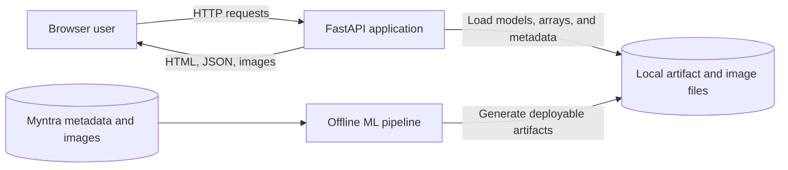
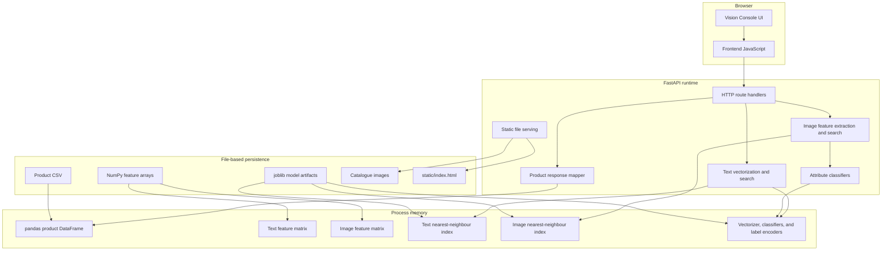
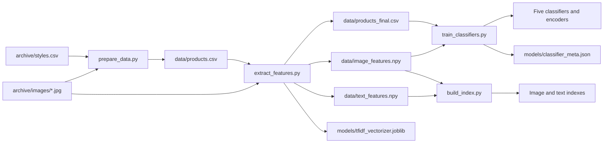
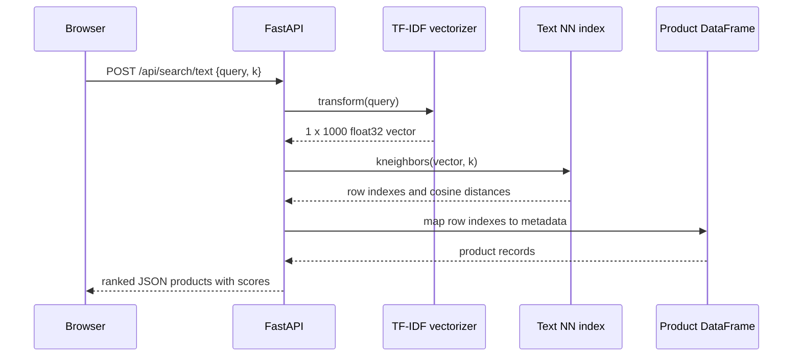
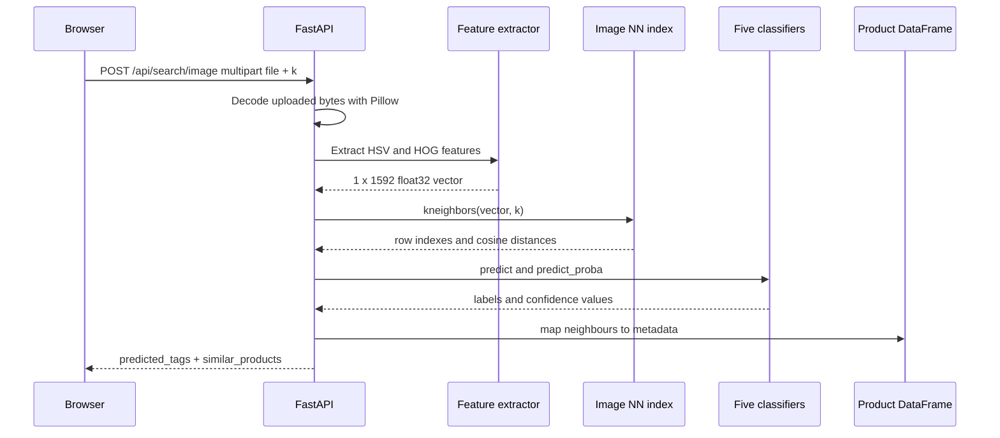
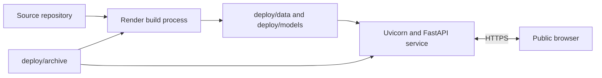

# Architecture Report

## Visual Fashion Search

| Report field | Value |
|---|---|
| Report date | 11 August 2026 |
| Architecture style | Single-process web application with an offline ML pipeline |
| Backend | FastAPI and Uvicorn |
| Frontend | Server-delivered HTML, CSS, and JavaScript |
| ML approach | Classical computer vision, TF-IDF, logistic regression, and nearest neighbours |
| Persistence | CSV, NumPy arrays, images, JSON metadata, and joblib artifacts |
| Deployment target | Local Python environment or Render web service |

## 1. Executive summary

Visual Fashion Search is a compact end-to-end machine-learning application for
searching a fashion catalogue by natural-language description or an uploaded
image. It also predicts five attributes for uploaded images: master category,
subcategory, base colour, season, and usage.

The system separates expensive, offline preparation from online request
handling. The offline pipeline cleans catalogue metadata, extracts fixed-size
image and text features, trains classifiers, and builds nearest-neighbour
indexes. The online FastAPI process loads all resulting artifacts into memory
once at startup and performs inference directly inside the web process.

This design is easy to understand, reproduce, and demonstrate. It avoids a
database, external search engine, model server, job queue, and frontend build
toolchain. The tradeoff is that runtime memory use and brute-force search cost
grow with the catalogue size, while scaling multiple web workers duplicates
the in-memory artifacts.

## 2. Architectural goals

The implemented architecture prioritizes:

- a complete ML-to-user workflow in one repository;
- CPU-compatible training and inference;
- straightforward local execution;
- reproducible artifact generation;
- minimal infrastructure dependencies;
- support for both a full local catalogue and a smaller hosted demo; and
- clear replacement points for stronger embedding models in the future.

The current system is optimized for demonstration and portfolio review rather
than high-throughput production traffic.

## 3. System context



The browser is the only interactive client. It communicates with the FastAPI
application through same-origin HTTP requests. The application does not depend
on a database or third-party API for its core search behavior.

Google Fonts are requested by the frontend from external domains. This affects
typography only; the application logic and search APIs remain local.

## 4. High-level component architecture



### 4.1 Frontend

`static/index.html` contains the complete user interface, styling, and browser
logic. There is no frontend compilation step or JavaScript framework.

The frontend performs the following operations:

- loads catalogue statistics from `GET /api/stats`;
- loads initial products from `GET /api/random`;
- sends text queries to `POST /api/search/text`;
- sends uploaded images as multipart form data to `POST /api/search/image`;
- renders product cards using the returned JSON;
- displays predicted tags and confidence values;
- loads deterministic samples for the help modal; and
- fetches a sample image and submits it through the normal image-search flow.

All API URLs are relative, so the browser and API are expected to share the
same origin.

### 4.2 FastAPI application

`app/main.py` is both the composition root and HTTP layer. At module import it:

1. resolves configured filesystem locations;
2. loads product metadata into a pandas DataFrame;
3. loads image and text feature arrays;
4. loads both nearest-neighbour indexes;
5. loads the TF-IDF vectorizer;
6. loads five classifiers and their label encoders; and
7. mounts the configured catalogue image directory at `/images`.

Route handlers then use these process-wide objects directly. There is no
separate service, repository, or dependency-injection layer.

### 4.3 Offline ML pipeline

The offline pipeline consists of four ordered scripts:

| Step | Script | Responsibility | Primary outputs |
|---:|---|---|---|
| 1 | `prepare_data.py` | Validate metadata against available images and remove incomplete records | `products.csv` |
| 2 | `extract_features.py` | Generate image and text features | Feature arrays, final CSV, TF-IDF vectorizer |
| 3 | `train_classifiers.py` | Train five image-based attribute classifiers | Classifiers, label encoders, evaluation metadata |
| 4 | `build_index.py` | Fit cosine nearest-neighbour indexes | Image and text indexes |

The scripts share paths through `config.py` and must run in sequence because
each stage consumes artifacts from the preceding stage.

### 4.4 File-based persistence

The application persists artifacts as ordinary files instead of using a
database or object store:

- CSV for product metadata;
- JPEG files for catalogue images;
- NumPy `.npy` arrays for dense feature matrices;
- joblib files for scikit-learn objects and label encoders; and
- JSON for classifier evaluation metadata.

This is simple and fast for local read-heavy usage. Updates require rebuilding
artifacts and restarting the web process; there is no online catalogue mutation
path.

## 5. Repository and module structure

```text
visual-fashion-search/
├── app/
│   └── main.py                    FastAPI runtime and API routes
├── archive/
│   ├── styles.csv                 Full raw metadata
│   └── images/                    Full catalogue images
├── data/                          Full processed data and feature arrays
├── models/                        Full indexes, models, encoders, and metrics
├── deploy/
│   ├── archive/                   Reduced raw demo catalogue
│   ├── data/                      Reduced processed demo data
│   └── models/                    Reduced demo models and indexes
├── static/
│   └── index.html                 Complete browser interface
├── docs/                          Project reports
├── config.py                      Environment-aware path resolution
├── prepare_data.py                Metadata validation and cleaning
├── extract_features.py            Image and text feature extraction
├── train_classifiers.py           Attribute-model training
├── build_index.py                 Search-index construction
├── build_demo_dataset.py          Deterministic reduced-dataset builder
├── requirements.txt               Python dependencies
└── render.yaml                    Hosted build and startup definition
```

## 6. Configuration architecture

`config.py` derives all default paths from the repository root. Three
environment variables allow the same code to operate on different artifact
sets:

| Environment variable | Default | Purpose |
|---|---|---|
| `DATASET_DIR` | `archive/` | Raw metadata and catalogue images |
| `APP_DATA_DIR` | `data/` | Processed CSV and NumPy arrays |
| `APP_MODELS_DIR` | `models/` | Vectorizer, indexes, classifiers, and encoders |

`STATIC_DIR` always resolves to `static/` under the repository root.

This configuration creates two supported profiles:

| Profile | Dataset paths | Intended use |
|---|---|---|
| Full local | Default root directories | Local evaluation using all 44,064 valid products |
| Reduced demo | Environment variables pointing to `deploy/` | Hosted or lightweight demonstration |

The data and model output directories are created when `config.py` is imported.
Configuration is process-level; it cannot vary by request.

## 7. Offline data and training flow



### 7.1 Metadata preparation

`prepare_data.py` reads the raw CSV with malformed-row skipping enabled. It
constructs each expected image filename from the product ID, discards products
whose corresponding JPEG is missing, and removes records missing base colour,
season, usage, or product display name.

An optional in-code `SUBSET_PER_CATEGORY` value can produce a stratified subset.
The dedicated `build_demo_dataset.py` script provides a command-line equivalent
for deployment data and uses a fixed random seed of 42 for reproducibility.

### 7.2 Image feature extraction

Every source image is converted to RGB and resized to 64 by 64 pixels. The
feature vector combines:

- a 24-dimensional HSV colour histogram: eight bins for each of three
  channels; and
- HOG features using eight orientations, 8-by-8-pixel cells, and 2-by-2-cell
  blocks.

The concatenated vector is L2-normalized. In the evaluated full dataset, each
image vector has 1,592 dimensions.

If a particular image cannot be processed, its feature is marked invalid and
the corresponding catalogue record is removed before final artifacts are
saved. This preserves row alignment between `products_final.csv` and both
feature matrices.

### 7.3 Text feature extraction

The text corpus concatenates:

- product display name;
- article type;
- base colour; and
- usage.

`TfidfVectorizer` uses English stop-word removal and a maximum vocabulary of
1,000 terms. The fitted vectorizer is saved for transforming online queries,
and the dense float32 catalogue matrix is saved for index construction.

### 7.4 Attribute classifiers

Five independent logistic-regression classifiers are trained from image
features. Label encoders map catalogue strings to numeric training labels and
back to API values.

| Target | Feature input | Class weighting |
|---|---|---|
| Master category | Full 1,592-dimensional vector | Balanced |
| Subcategory | Full 1,592-dimensional vector | Balanced |
| Base colour | First 24 HSV histogram dimensions | None |
| Season | Full 1,592-dimensional vector | Balanced |
| Usage | Full 1,592-dimensional vector | Balanced |

Training uses an 85/15 split with random seed 42. Stratification is enabled
when every class has at least two examples. Accuracy and macro F1 are written
to `classifier_meta.json` alongside class counts and feature-selection details.

### 7.5 Search indexes

Both retrieval modes use scikit-learn `NearestNeighbors` with cosine distance
and the brute-force algorithm:

- the image index is fitted on normalized HSV-plus-HOG vectors; and
- the text index is fitted on dense TF-IDF vectors.

The API converts cosine distance to a displayed similarity value using
`1 - distance`.

## 8. Online request flows

### 8.1 Text search



The request schema is defined by the Pydantic `TextQuery` model. `query` is
required and `k` defaults to 12. The frontend requests 18 results.

### 8.2 Image search and auto-tagging



Uploaded bytes are decoded as an RGB image. The current implementation writes
the decoded image to a temporary JPEG because the shared feature extractor
accepts a filesystem path. The temporary file is removed in a `finally` block.

Invalid image data produces HTTP 400. Model confidence is the maximum class
probability returned by the relevant logistic-regression classifier.

### 8.3 Catalogue browsing

- `/api/random` samples products from the in-memory DataFrame for the landing
  grid.
- `/api/samples` takes up to two deterministic products from each master
  category and is used by the help modal.
- `/api/product/{id}` performs a DataFrame filter and returns HTTP 404 when the
  ID does not exist.
- `/api/stats` computes total size and master-category counts.
- `/images/{filename}` is provided by FastAPI's `StaticFiles` mount.

## 9. API architecture

| Method | Endpoint | Input | Output |
|---|---|---|---|
| GET | `/` | None | Frontend HTML file |
| GET | `/api/random` | Query parameter `n`, default 12 | Product array |
| GET | `/api/samples` | Query parameter `n`, default 12 | Category-diverse product array |
| GET | `/api/product/{product_id}` | Integer path ID | One product or HTTP 404 |
| POST | `/api/search/text` | JSON `query` and optional `k` | Ranked product array |
| POST | `/api/search/image` | Multipart image and optional `k` | Predicted tags and ranked products |
| GET | `/api/stats` | None | Product count and category counts |
| GET | `/images/{filename}` | Image filename | Catalogue image |
| GET | `/docs` | None | Generated OpenAPI interface |

Product responses contain ID, name, gender, category fields, article type,
colour, season, usage, and a relative image URL. Search responses add a rounded
similarity score.

The CORS middleware currently allows every origin, HTTP method, and header.
This supports flexible demonstration clients but is broader than necessary for
a same-origin production deployment.

## 10. Runtime and memory model

The evaluated full profile contains:

| Runtime artifact | Shape or approximate file size |
|---|---:|
| Product records | 44,064 rows |
| Image feature matrix | `(44064, 1592)`, 280.6 MB |
| Text feature matrix | `(44064, 1000)`, 176.3 MB |
| Image index file | 280.6 MB |
| Text index file | 176.3 MB |

The application loads the feature arrays and the fitted indexes. Because the
indexes also persist their training data, the process can hold duplicate large
representations. Multiple Uvicorn workers may duplicate these structures again
unless the operating environment can safely share copy-on-write pages.

The current architecture therefore favors one worker and moderate traffic.
Brute-force cosine search is linear in catalogue size for each request. This is
acceptable for the present catalogue and demo purpose but is the main scaling
constraint.

## 11. Deployment architecture

`render.yaml` defines a single Render Python web service.

During the hosted build it:

1. installs Python dependencies;
2. points configuration at the reduced `deploy/` directories;
3. runs all four pipeline stages; and
4. writes fresh processed artifacts and models under `deploy/`.

At runtime it exports the same paths and starts one Uvicorn application bound
to `0.0.0.0` and the platform-provided port.



The reduced archive is deterministically created by retaining up to 300
products per master category with random seed 42. This gives hosted builds a
smaller memory and processing footprint than the full local profile.

## 12. Architectural qualities

### 12.1 Strengths

- **Low operational complexity:** no database, cache, queue, or external search
  cluster is required.
- **Clear offline/online boundary:** expensive feature extraction and training
  happen before request serving.
- **Portable paths:** environment variables select full or reduced artifact
  profiles without changing application code.
- **CPU-friendly implementation:** classical features and linear classifiers
  avoid GPU requirements.
- **Reproducibility:** sampling and train/test splitting use fixed random seeds.
- **Simple frontend delivery:** one HTML file removes build-tool and hosting
  complexity.
- **Replaceable feature representation:** downstream classifiers and indexes
  consume fixed-size vectors, so a future embedding extractor can preserve the
  broad pipeline structure.

### 12.2 Constraints and risks

- **Startup coupling:** missing or incompatible artifacts prevent application
  import and startup; there is no readiness-specific artifact validation.
- **Memory duplication:** feature arrays and fitted indexes contain large,
  overlapping data structures.
- **Linear retrieval cost:** brute-force nearest-neighbour search does not scale
  efficiently to much larger catalogues.
- **Single-module backend:** route, inference, serialization, and startup logic
  are combined in `app/main.py`, making isolated testing and future extension
  harder.
- **Synchronous CPU work:** image feature extraction and nearest-neighbour
  computation execute in the web process and can reduce concurrency.
- **Unbounded request parameters:** `k` and list sizes are not constrained to a
  positive maximum at schema level.
- **Upload controls:** there is no explicit upload-size limit or pixel-count
  limit before Pillow decoding.
- **Broad CORS policy:** all origins, methods, and headers are accepted.
- **Temporary-file overhead:** uploaded images are re-encoded to disk before
  feature extraction.
- **No artifact version contract:** joblib files are coupled to Python and
  library versions without an explicit manifest or compatibility check.
- **No online update path:** adding products requires rebuilding and restarting
  the application.
- **Limited observability:** startup uses standard output, while structured
  logging, request metrics, tracing, and health/readiness endpoints are absent.

## 13. Security and privacy considerations

The application does not implement authentication or authorization. All
catalogue and search endpoints are public in the current architecture.

Uploaded image bytes are processed locally and the temporary JPEG is deleted
after feature extraction. The application does not intentionally persist the
original upload, but operational logging, crash behavior, and host-level
temporary-file policy should still be reviewed for a production privacy claim.

Recommended production controls include:

- restrict accepted content types and validate decoded image dimensions;
- enforce request-body, pixel-count, result-count, and timeout limits;
- narrow CORS to known frontend origins;
- run behind HTTPS and a reverse proxy;
- add rate limiting and abuse controls;
- use a non-privileged service account and restricted filesystem permissions;
- pin and scan dependencies and serialized artifacts; and
- avoid loading joblib artifacts from untrusted sources because deserialization
  can execute code.

## 14. Recommended evolution path

### Near term

1. Introduce settings and artifact-loader modules with explicit startup
   validation.
2. Add `/health` and `/ready` endpoints, structured logs, and request timing.
3. Constrain `k`, `n`, upload byte size, and decoded image dimensions.
4. Refactor feature extraction to accept an in-memory Pillow image or NumPy
   array and remove the temporary-file round trip.
5. Add automated API, pipeline, and browser tests in continuous integration.
6. Record an artifact manifest containing schema, dimensions, checksums,
   training timestamp, source revision, and library versions.

### Medium term

1. Remove duplicate runtime matrices when the fitted search index already owns
   the required vectors.
2. Replace DataFrame ID filtering with an indexed lookup structure.
3. Separate HTTP routes, domain services, schemas, and artifact repositories.
4. Move expensive image inference to a bounded worker pool if concurrent usage
   increases.
5. Measure latency, memory, and throughput before choosing worker counts.

### Larger-scale architecture

For a substantially larger or frequently updated catalogue:

- replace brute-force indexes with an approximate nearest-neighbour engine such
  as FAISS, pgvector, or a managed vector database;
- store catalogue metadata in a database keyed by stable product IDs;
- store images and immutable artifacts in object storage;
- version and deploy models independently from the web interface;
- use CLIP-style multimodal embeddings to place images and text in a shared
  semantic space; and
- use blue/green artifact loading or versioned indexes for zero-downtime
  catalogue updates.

## 15. Architecture decision summary

| Decision | Current choice | Reason | Main tradeoff |
|---|---|---|---|
| Application topology | Single FastAPI process | Minimal deployment complexity | Limited isolation and scaling |
| Persistence | Local files | Portable and easy to inspect | No transactions or live updates |
| Image representation | HSV plus HOG | CPU-friendly and deterministic | Lower semantic quality than deep embeddings |
| Text representation | TF-IDF | Fast and explainable | Weak semantic understanding |
| Retrieval | Brute-force cosine neighbours | Exact and simple | Linear query cost |
| Attribute models | Independent logistic regressions | Lightweight probabilities and training | Limited nonlinear capacity |
| Frontend | Single static HTML file | No build system required | Harder to modularize as UI grows |
| Deployment data | Reduced deterministic subset | Fits hosted demo constraints | Does not represent full-catalogue behavior |
| Configuration | Environment-selected directories | Same code for local and hosted modes | Paths must be mutually consistent |

## 16. Final assessment

The architecture successfully supports the project's intended demonstration:
an understandable, CPU-compatible fashion search system that covers data
preparation, feature engineering, model training, retrieval, inference, API
delivery, and browser interaction.

Its simplicity is a deliberate strength at the current scale. The most
important production concerns are runtime memory duplication, linear search
cost, unrestricted input sizes, broad CORS, limited observability, and tight
coupling inside the FastAPI module. These concerns do not prevent local use or
portfolio demonstration, but they define the priority order for evolving the
system into a resilient multi-user service.
