# Dataflow Report

## Visual Fashion Search and Auto-Tagger

| Report field | Value |
|---|---|
| Report date | 11 August 2026 |
| System | Visual Fashion Search and Auto-Tagger |
| Dataflow scope | Offline preparation, model training, application startup, browser interaction, search, and deployment |
| Primary implementation | Python, FastAPI, scikit-learn, NumPy, pandas, Pillow, scikit-image, and browser JavaScript |

## 1. Purpose

This Dataflow Report explains how data enters, moves through, is transformed by,
and leaves the Visual Fashion Search application. It documents both major
execution modes:

- the **offline pipeline**, which converts raw fashion metadata and images into
  searchable features, classifiers, and indexes; and
- the **online application**, which serves catalogue data and processes text or
  image search requests using the generated artifacts.

The report also identifies persistent stores, in-memory representations,
validation points, trust boundaries, failure paths, and important data-handling
risks.

## 2. Dataflow notation

The diagrams use the following conceptual elements:

| Element | Meaning |
|---|---|
| External entity | A user, browser, source dataset, or hosting platform outside the application process |
| Process | Code that validates, transforms, searches, predicts, or serializes data |
| Data store | A persistent CSV, image directory, NumPy array, JSON file, or joblib artifact |
| Flow | Data passed between entities, processes, memory, or stores |
| Trust boundary | A point where input moves between different control or validation domains |

## 3. Dataflow context diagram

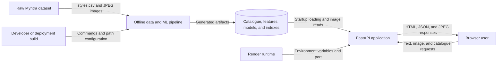

At the highest level, raw catalogue data enters through the offline pipeline.
The generated files become read-only runtime inputs. Browser requests never
change catalogue or model data.

## 4. Data domains

The system processes five main data domains:

| Domain | Examples | Origin | Sensitivity |
|---|---|---|---|
| Product metadata | Product ID, name, gender, categories, colour, season, usage | Source CSV | Low; catalogue data |
| Catalogue images | Product JPEG files | Source image archive | Low to moderate; licensed dataset content |
| User search input | Text query, uploaded image, requested result count | Browser | Potentially sensitive, especially uploaded images |
| Derived features | HSV/HOG vectors and TF-IDF vectors | Offline and online transforms | Derived model input data |
| Model artifacts | Vectorizer, indexes, classifiers, label encoders, metrics | Training and index-building stages | Integrity-sensitive executable artifacts |

## 5. Persistent data stores

### DS-01: Raw full catalogue

| Property | Description |
|---|---|
| Location | `archive/` by default |
| Metadata | `archive/styles.csv` |
| Images | `archive/images/{product_id}.jpg` |
| Producer | External source dataset |
| Consumers | `prepare_data.py`, `extract_features.py`, and the runtime image server |

The CSV is treated as the catalogue authority. Image association is derived by
converting each product ID to a filename in the form `{id}.jpg`.

### DS-02: Processed full data

| File | Purpose | Observed size or shape |
|---|---|---:|
| `data/products.csv` | Cleaned metadata after image and null validation | 44,064 valid rows in the evaluated build |
| `data/products_final.csv` | Metadata aligned with successfully extracted features | 44,064 rows |
| `data/image_features.npy` | Normalized catalogue image vectors | `(44064, 1592)` |
| `data/text_features.npy` | Dense catalogue TF-IDF vectors | `(44064, 1000)` |

Row position is the join key among `products_final.csv`, both feature matrices,
and both nearest-neighbour indexes. Preserving row order is therefore a central
data-integrity requirement.

### DS-03: Full model and search artifacts

| Artifact | Data carried |
|---|---|
| `models/tfidf_vectorizer.joblib` | Vocabulary, inverse document frequencies, and text-transform configuration |
| `models/image_index.joblib` | Fitted image nearest-neighbour index and training vectors |
| `models/text_index.joblib` | Fitted text nearest-neighbour index and training vectors |
| `models/clf_{target}.joblib` | One logistic-regression model per predicted attribute |
| `models/le_{target}.joblib` | Numeric-to-string class mapping for each attribute |
| `models/classifier_meta.json` | Target list, feature selection, class counts, accuracy, and macro F1 |

### DS-04: Reduced deployment artifacts

`deploy/archive`, `deploy/data`, and `deploy/models` mirror the raw, processed,
and model-store structure using a deterministic category-balanced subset. The
same pipeline and application code read these stores when environment variables
point to them.

### DS-05: Frontend

`static/index.html` contains static HTML, CSS, and JavaScript. FastAPI reads and
returns this file for `GET /`. It is not modified by runtime requests.

## 6. Configuration dataflow

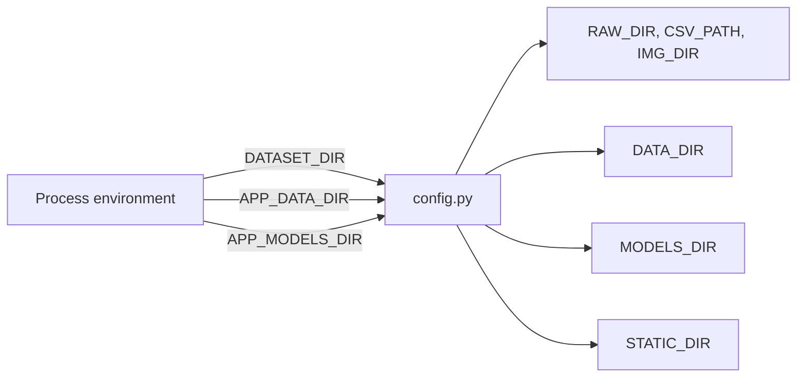

If an environment variable is absent, `config.py` uses a repository-relative
default. Path resolution occurs when the module is imported. `DATA_DIR` and
`MODELS_DIR` are created automatically if absent.

Configuration must identify a mutually compatible raw dataset, processed data
directory, and model directory. The application does not currently validate a
shared artifact version or checksum.

## 7. Offline pipeline overview

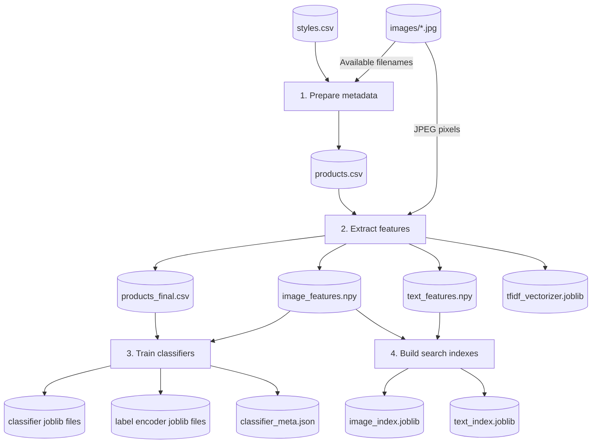

The four stages form an ordered batch flow. There is no orchestration engine;
the operator or deployment build executes each script in sequence.

## 8. Detailed offline dataflows

### DF-01: Metadata preparation

**Producer:** `prepare_data.py`

**Inputs:**

- raw CSV rows from `styles.csv`; and
- the set of filenames present in the configured image directory.

**Transformations:**

1. Read the CSV with malformed-row skipping enabled.
2. Convert each product ID to `{id}.jpg` and store it in `image_file`.
3. Retain only products whose expected image filename exists.
4. Drop rows missing `baseColour`, `season`, `usage`, or
   `productDisplayName`.
5. Optionally sample up to a configured number of records per master category.
6. Reset or preserve row order as implemented and serialize cleaned metadata.

**Output:** `products.csv`.

**Integrity rule:** Every output record must refer to an image that existed at
preparation time.

**Failure behavior:** CSV access or output-write failures terminate the script.
Malformed CSV rows are skipped rather than terminating processing.

### DF-02: Image feature generation

**Producer:** `extract_features.py`

**Input for each record:** `image_file` joined to the configured image
directory.

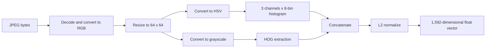

The first 24 values represent normalized HSV histogram counts. The remaining
values represent shape and texture through HOG.

If one image fails to decode or transform, the script records a missing
feature for that row, logs the failure, removes that product from the final
DataFrame, and stacks only valid vectors.

**Outputs:**

- `image_features.npy`; and
- the image-aligned portion of `products_final.csv`.

### DF-03: Text feature generation

For every image-valid catalogue row, the extractor builds one text document:

```text
productDisplayName + articleType + baseColour + usage
```

Null values in these source fields are replaced with empty strings. A TF-IDF
vectorizer removes English stop words and retains at most 1,000 features.

**Outputs:**

- `text_features.npy`, stored as dense float32 values;
- `tfidf_vectorizer.joblib`; and
- `products_final.csv`, which defines the shared final row order.

### DF-04: Classifier training

`train_classifiers.py` joins `products_final.csv` and `image_features.npy` by
row position.

For each of five target columns:

1. cast catalogue labels to strings;
2. encode labels as integers;
3. choose the full image vector, except that base colour uses only the first 24
   colour dimensions;
4. split rows into 85% training and 15% test data using random seed 42;
5. train logistic regression;
6. predict test labels;
7. calculate accuracy and macro F1; and
8. save the classifier, label encoder, and metric values.

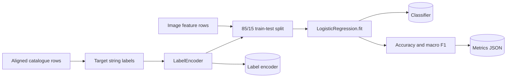

Classifiers other than base colour use balanced class weighting. Stratified
splitting is used only when every encoded class contains at least two samples.

### DF-05: Search-index construction

`build_index.py` reads both feature matrices and independently fits two
brute-force cosine nearest-neighbour indexes.

| Input | Index output | Online query type |
|---|---|---|
| `image_features.npy` | `image_index.joblib` | Uploaded-image vector |
| `text_features.npy` | `text_index.joblib` | TF-IDF query vector |

The index returns catalogue row positions and cosine distances. It does not
return product IDs directly.

### DF-06: Deployment-subset generation

`build_demo_dataset.py` reads the full raw catalogue and available image names,
applies the same required-field filtering, and samples at most 300 rows per
master category by default. Sampling uses random seed 42.

It writes a reduced `deploy/archive/styles.csv` and copies the selected images
to `deploy/archive/images`. The standard four-stage pipeline then produces
reduced data and model artifacts from this archive.

## 9. Application startup dataflow

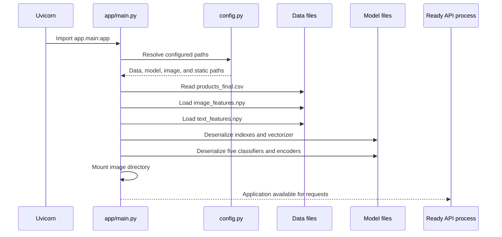

The following objects remain process-global after startup:

- product DataFrame;
- image and text feature arrays;
- image and text indexes;
- TF-IDF vectorizer;
- five classifiers; and
- five label encoders.

If any required file is missing, incompatible, or corrupt, import fails and the
application does not become ready. There is no degraded mode.

## 10. Runtime browser dataflows

### DF-07: Initial page load

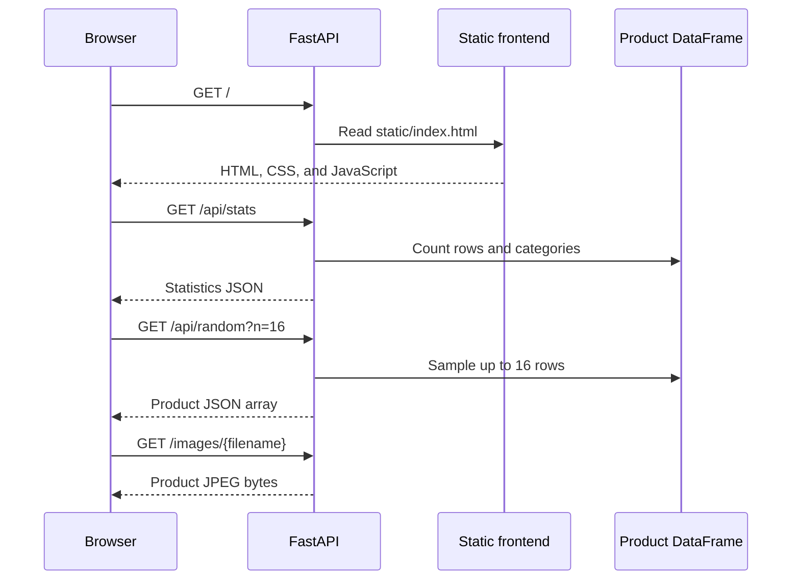

The frontend escapes text values before inserting product metadata into its
generated HTML. Product image paths originate from the server response.

### DF-08: Text search

**External input:** User-entered text and a requested result count.


Detailed flow:

1. The browser trims the input and submits JSON containing `query` and `k`.
2. Pydantic verifies that the required query field exists and parses `k` as an
   integer.
3. The fitted vectorizer maps text to the same 1,000-dimensional feature space
   used by the catalogue.
4. The query vector is converted to float32.
5. The text index returns up to `min(k, catalogue_size)` neighbours.
6. Each row position is used to read product metadata from the DataFrame.
7. Cosine distance is transformed to `score = 1 - distance` and rounded to four
   decimal places.
8. FastAPI serializes the ranked list as JSON.
9. The browser renders product cards and retrieves their JPEG images through
   `/images`.

The query text is not persisted by application code.

### DF-09: Image upload, retrieval, and tagging

**External input:** Multipart file bytes and requested result count.

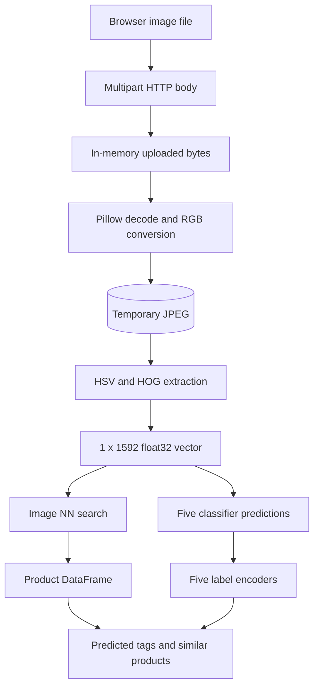

Detailed flow:

1. Browser JavaScript packages the selected file and `k` in `FormData`.
2. FastAPI reads the complete upload into memory.
3. Pillow attempts to decode the bytes and converts the image to RGB.
4. Invalid bytes result in HTTP 400 with `Invalid image file`.
5. The decoded image is written as a temporary JPEG.
6. The shared feature extractor reads that JPEG, resizes it, and produces an
   L2-normalized 1,592-dimensional vector.
7. The temporary path is removed in a `finally` block.
8. The image index returns the nearest catalogue row positions and distances.
9. Each of the five classifiers predicts an encoded class and class
   probabilities. Base colour receives only the first 24 vector values.
10. Each label encoder converts the numeric prediction back to a catalogue
    string.
11. The highest class probability becomes a confidence value rounded to three
    decimal places.
12. The API responds with `predicted_tags` and `similar_products`.

The application does not intentionally retain the uploaded image after the
request completes. The temporary file contains a re-encoded form of the upload
for the duration of feature extraction.

### DF-10: Help-modal sample search

The help workflow deliberately reuses the production image-search path:

1. Browser requests `GET /api/samples?n=12`.
2. Backend samples up to two products per master category with random seed 42.
3. Browser retrieves a selected product's `image_url`.
4. Browser converts the image response to a blob.
5. Browser submits the blob to `POST /api/search/image`.
6. Normal image tagging and similarity retrieval occur.

This verifies the user journey without a special inference endpoint.

### DF-11: Direct product retrieval

For `GET /api/product/{product_id}`, FastAPI parses the path value as an
integer. The application filters the DataFrame by the stable product `id`. It
returns one mapped record or HTTP 404 when no row matches.

### DF-12: Catalogue statistics and samples

- `GET /api/stats` reads the in-memory DataFrame length and calculates master
  category value counts.
- `GET /api/random` samples the DataFrame without a fixed seed.
- `GET /api/samples` groups by master category and applies deterministic
  within-group sampling.

These operations are read-only and produce no persistent state.

## 11. Core runtime data structures

### 11.1 Product response

The `row_to_dict` mapper converts a pandas row to this external structure:

| Field | Source | Transformation |
|---|---|---|
| `id` | `id` | Converted to integer |
| `name` | `productDisplayName` | Renamed |
| `gender` | `gender` | Passed through |
| `masterCategory` | `masterCategory` | Passed through |
| `subCategory` | `subCategory` | Passed through |
| `articleType` | `articleType` | Passed through |
| `baseColour` | `baseColour` | Passed through |
| `season` | `season` | Passed through |
| `usage` | `usage` | Passed through |
| `image_url` | `image_file` | Prefixed with `/images/` |
| `score` | Cosine distance | Search routes only; `round(1 - distance, 4)` |

### 11.2 Predicted tag

Each predicted attribute has the following shape:

```json
{
  "value": "Apparel",
  "confidence": 0.833
}
```

`value` comes from the label encoder. `confidence` is the maximum probability
from the classifier, not a calibrated guarantee of correctness.

### 11.3 Image-search response

```json
{
  "predicted_tags": {
    "masterCategory": {"value": "...", "confidence": 0.0},
    "subCategory": {"value": "...", "confidence": 0.0},
    "baseColour": {"value": "...", "confidence": 0.0},
    "season": {"value": "...", "confidence": 0.0},
    "usage": {"value": "...", "confidence": 0.0}
  },
  "similar_products": []
}
```

## 12. Identifier and alignment rules

The architecture uses two different identifiers:

- **Product ID** is stable catalogue identity and is exposed in the API.
- **Row position** is internal search identity and connects feature vectors,
  nearest-neighbour results, and DataFrame records.

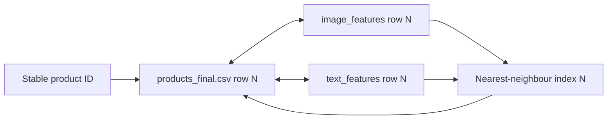

Reordering or independently regenerating one artifact can silently associate a
neighbour vector with the wrong product. The pipeline avoids this by generating
the final CSV and both matrices together, but the current artifacts do not
carry an explicit shared version, checksum, or row-ID manifest.

## 13. Validation and error dataflow

| Boundary | Current validation | Failure result |
|---|---|---|
| Raw CSV input | Malformed-row skipping | Invalid CSV rows omitted |
| Raw image association | Filename existence check | Product omitted |
| Required training fields | Null filtering | Product omitted |
| Feature extraction | Per-image exception handling | Image and row omitted from final data |
| Text-search JSON | Pydantic type and required-field parsing | HTTP 422 |
| Product path ID | FastAPI integer parsing | HTTP 422 for invalid type |
| Missing product | DataFrame match check | HTTP 404 |
| Uploaded image | Pillow decode attempt | HTTP 400 |
| Missing startup artifact | Python/file/joblib exception | Application startup failure |

Current gaps include no explicit positive upper bounds for `k` or `n`, no
application-level upload-byte limit, no decoded pixel-count limit, and no
artifact compatibility manifest.

## 14. Trust boundaries

### TB-01: Source dataset to offline pipeline

CSV rows and images cross from external dataset content into Python parsers and
image decoders. The pipeline filters missing data but assumes that accepted
content is safe and correctly licensed.

### TB-02: Serialized artifacts to application process

Joblib deserialization crosses a high-impact integrity boundary. Joblib files
must be treated as trusted build artifacts because malicious serialized content
can execute code while loading.

### TB-03: Browser to public API

Text, query parameters, path identifiers, and uploaded bytes enter the FastAPI
process. Pydantic and Pillow provide basic parsing, but resource limits and
authentication are not implemented.

### TB-04: Application to temporary storage

Decoded user imagery is written to an operating-system temporary file and then
read by the feature extractor. Cleanup is explicitly attempted even if feature
extraction fails.

### TB-05: Application to external font providers

The browser contacts Google Fonts based on links in the served HTML. This is a
browser-side network flow and may disclose standard request metadata to that
provider.

## 15. Data lifecycle

| Data | Creation | Runtime use | Retention |
|---|---|---|---|
| Raw catalogue metadata | Dataset acquisition | Offline preparation | Persistent until manually replaced |
| Catalogue JPEGs | Dataset acquisition or demo subset build | Feature extraction and image responses | Persistent until manually replaced |
| Processed CSV files | Preparation and extraction | Startup metadata load | Persistent until pipeline rerun |
| Feature arrays | Feature extraction | Training, index build, and startup | Persistent until pipeline rerun |
| Models and indexes | Training and index build | Startup and inference | Persistent until pipeline rerun |
| Text query | Browser request | One vectorization and search operation | Not intentionally persisted |
| Uploaded image bytes | Browser request | Decode during one request | In memory for request lifetime |
| Temporary upload JPEG | Image request | Feature extraction | Deleted after extraction attempt |
| API response | Runtime serialization | Browser rendering | Not stored by backend application code |

Browser caches, reverse proxies, operating-system temporary-file behavior, and
hosting-platform logs may introduce additional retention outside the explicit
application flow.

## 16. Deployment dataflow

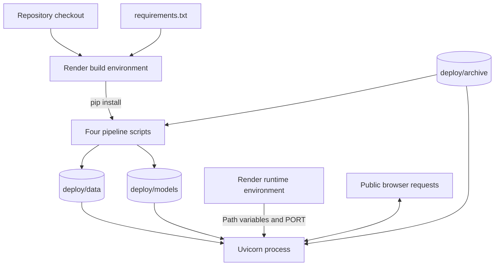

`render.yaml` points all three configurable directory families to `deploy/`
during both build and startup. The build regenerates processed data and models;
the running service then reads those generated files.

## 17. Performance implications of current flows

- Full image and text feature arrays are loaded during startup.
- Fitted nearest-neighbour indexes also retain catalogue vectors, creating
  potentially duplicated in-memory data.
- Both indexes use brute-force cosine distance, so each query compares against
  the entire configured catalogue.
- Dense TF-IDF storage consumes more disk and memory than a sparse
  representation.
- Image requests read full uploads into memory before decoding.
- Image inference performs CPU feature extraction and five classifier calls in
  the web process.
- Product results are mapped from DataFrame row positions after each search.
- Product lookup by ID scans through a DataFrame boolean comparison rather than
  using a prebuilt ID map.

These flows are suitable for the current demonstration but should be measured
under concurrency before production use.

## 18. Data quality and model-evaluation flow

The training stage writes holdout accuracy and macro F1 to
`classifier_meta.json`. In the full evaluated artifact set, the stored values
are:

| Target | Classes | Accuracy | Macro F1 |
|---|---:|---:|---:|
| Master category | 7 | 0.9363 | 0.6885 |
| Subcategory | 45 | 0.8455 | 0.5813 |
| Base colour | 46 | 0.2481 | 0.0157 |
| Season | 4 | 0.6256 | 0.6335 |
| Usage | 8 | 0.6832 | 0.3708 |

These values flow from a single 85/15 split rather than cross-validation. The
low base-colour macro F1 indicates severe per-class weakness despite the
operational success of the dataflow. Runtime confidence values should therefore
be presented as model estimates, not guarantees.

## 19. Dataflow risks and recommended controls

| Priority | Risk | Recommended control |
|---:|---|---|
| High | Untrusted joblib data can execute code | Load only signed or checksum-verified build artifacts |
| High | Large or decompression-bomb image uploads can exhaust resources | Enforce byte, dimension, pixel-count, and processing-time limits |
| High | Independently mismatched artifacts can corrupt result mapping | Add one manifest with IDs, dimensions, versions, and checksums |
| Medium | Unbounded or negative `k` and `n` values can cause errors or excessive work | Add validated minimum and maximum constraints |
| Medium | Full upload held in memory | Stream to a bounded buffer or reject over-limit content early |
| Medium | Temporary disk round trip adds exposure and latency | Refactor feature extraction to consume an in-memory image |
| Medium | Brute-force indexes scale linearly | Adopt an approximate vector index when catalogue growth requires it |
| Medium | Broad CORS permits any web origin | Restrict CORS to approved origins |
| Medium | No request or inference observability | Add structured logs, metrics, correlation IDs, and latency/error tracking |
| Low | External font requests create an extra browser dataflow | Self-host fonts or document the external dependency |

## 20. Recommended future dataflow

For a production-scale version, the target flow could separate durable data,
model serving, and search infrastructure:

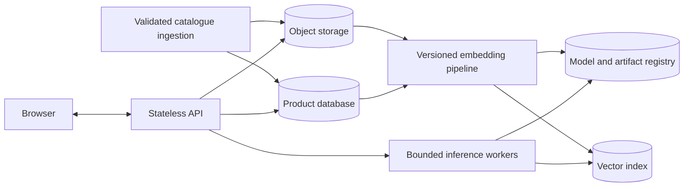

Key changes would include stable product IDs inside the vector index, immutable
versioned artifact bundles, a metadata database, object storage for images,
bounded image-processing workers, and explicit lineage from source data to
deployed model version.

## 21. Final assessment

The implemented dataflow is coherent and traceable. Raw metadata and images are
cleaned before feature extraction; failed image rows are removed while keeping
the final CSV and feature matrices aligned; training and retrieval artifacts
are derived from those aligned rows; and runtime requests use the same saved
transformers and feature logic as the offline pipeline.

The most important invariant is row-position consistency across final metadata,
feature arrays, and nearest-neighbour indexes. The most important runtime trust
boundary is user-supplied image decoding, while the most important build-time
trust boundary is joblib artifact loading.

For the current local and demonstration scope, the flows are appropriately
simple and operational. Production hardening should prioritize artifact
versioning, bounded inputs, in-memory image processing, narrower CORS,
observability, and scalable vector retrieval.
